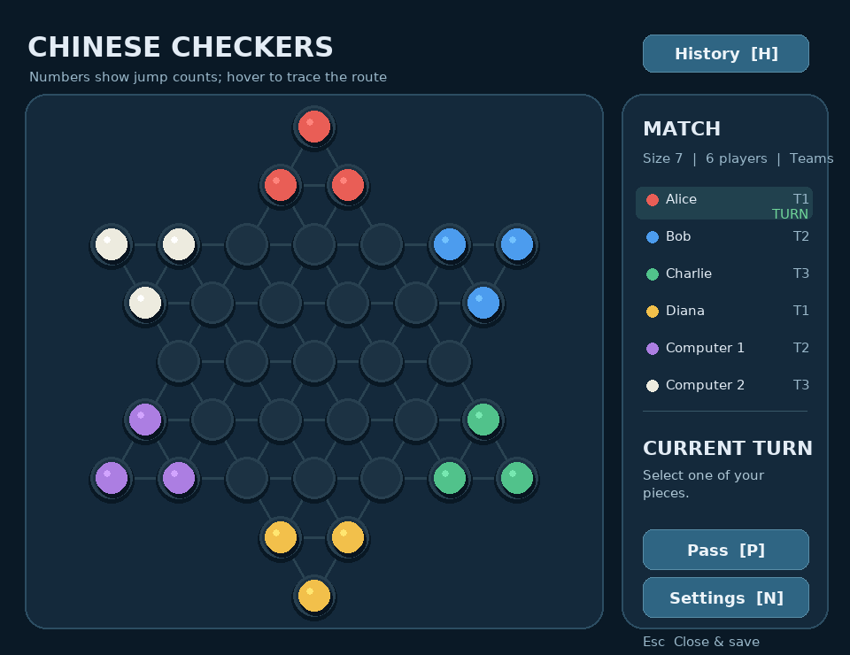
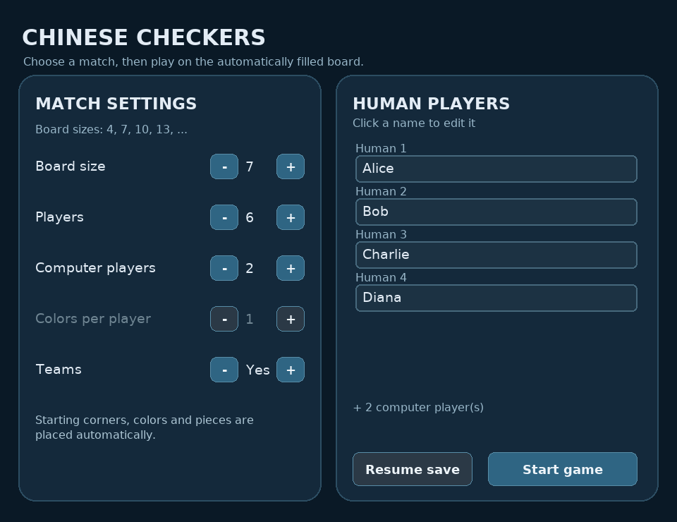

# Chinese Checkers

A configurable Chinese Checkers game written in Python, with terminal and Pygame interfaces, computer players, team matches, and JSON save/load support.



## Features

- Play with 2, 3, 4, or 6 players, including computer-controlled opponents.
- Choose board sizes `4`, `7`, `10`, and larger sizes of the form `3n + 1`.
- Use multiple colors per player in two- and three-player matches, or teams in four- and six-player matches.
- Configure a match in either interface; starting positions are placed automatically.
- Preview legal destinations and multi-jump routes in the resizable graphical window.
- Resume unfinished games and view turn history, with separate saves for terminal and graphical play.

## Installation

Requires **Python 3.9 or later**. Open a terminal in the project root, which contains `pyproject.toml` and the `chinese_checkers/` directory.

For graphical play:

```bash
python -m pip install -e ".[gui]"
```

For terminal play only:

```bash
python -m pip install -e .
```

On Windows, use `py -3` in place of `python` if needed. A virtual environment is recommended.

## Running the Game

### Graphical interface

Start a new match with one computer player preselected:

```bash
python -m chinese_checkers.gui --new --computer
```

Resume an unfinished graphical match, or open settings when no save exists:

```bash
python -m chinese_checkers.gui
```

`--new` deletes the previous graphical save and opens settings for a new match.



| Control | Action |
| --- | --- |
| Click a piece, then a highlighted destination | Make a legal move |
| Hover over a highlighted destination | Preview the jump route |
| `P` / Pass | Pass the current turn |
| `H` / History | Toggle turn history |
| `N` / Settings | Configure a new match |
| `Esc` | Close the window |

On Windows, double-click `start_new_game.bat` to open a new match or `start_gui.bat` to resume. These launchers run from the project directory and install the graphical dependency if needed. Extract the entire project before using them.

### Terminal interface

```bash
python -m chinese_checkers
```

Follow the prompts to configure or resume a match. Enter coordinates as `row,column`, starting from `1`, or enter `pass` at the start of a turn. Internally, coordinates are zero-based.

```bash
python -m chinese_checkers --help
```

Saves and logs are created in the directory from which the game runs. They are excluded from version control.

## Architecture

Both interfaces use the same game state, setup logic, and turn controller.

| Component | Responsibility |
| --- | --- |
| `Board` | Board geometry, legal steps and jumps, and path searches |
| `Ball`, `Player` | Piece locations and player data |
| `Game` | Match state, move validation, victory conditions, and rankings |
| `GameSession` | Turn progression and events consumed by both interfaces |
| `ComputerStrategy` | Computer move selection using the board's movement rules |
| `setup.py` | Configuration validation, automatic placement, and save restoration |
| `gui.py`, `gui_setup.py` | Graphical input, settings, board rendering, and history |
| `terminal.py`, `cli.py` | Terminal input, output, and program entry point |
| `storage.py`, `logs.py` | JSON persistence and turn history |

`Game.apply_move` validates ownership and legality before updating both the board and the corresponding piece. `GameSession` advances turns without reading input or printing, allowing the terminal and graphical interfaces to share the same rules.

## Computer Player and Path Search

`Board.jump_paths` uses breadth-first search to find reachable destinations and their shortest jump routes. Each jump crosses an occupied cell and lands in an empty cell. The graphical interface uses these routes to show intermediate landings.

The computer player uses goal-directed heuristics, reachability checks, and path searches to select moves and avoid blocking its own target area. It is a heuristic strategy with randomized choices, rather than an optimal adversarial search engine.

## Tests

Install the testing and graphical dependencies, then run the suite:

```bash
python -m pip install -e ".[test,gui]"
python -m pytest -q
```

The suite covers board geometry, movement rules, player and piece data, setup configurations, team matches, computer moves, save/load and turn order, and graphical interaction. Graphical rendering tests use a headless display.

## Project Layout

- `chinese_checkers/` — game engine, strategies, persistence, and both interfaces.
- `tests/` — unit and integration tests.
- `assets/` — screenshots used in this README.
- `pyproject.toml` — package metadata and optional dependencies.
- `start_gui.bat`, `start_new_game.bat` — Windows launchers.


